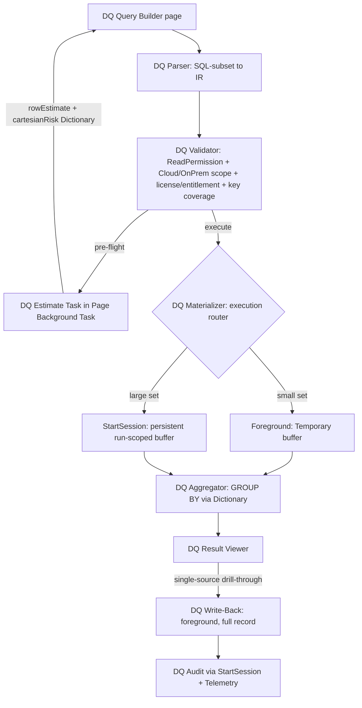
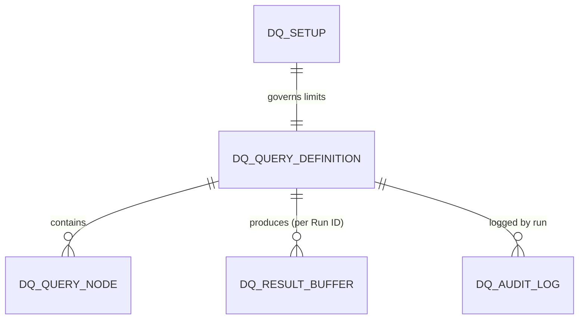

# Architecture: Dyna Query Engine

**Date**: 2026-07-06
**Complexity**: HIGH
**Author**: al-architect
**Status**: Approved

> **Skills applied**: `skill-performance, skill-permissions`
> *(List only skills actually loaded. The Conductor and Review Subagent use this for downstream traceability.)*

---

## 1. Executive Summary

Dyna Query Engine is a **read-only dynamic query engine** for Business Central Online that resolves arbitrary joins between tables at runtime through AL metadata (`RecordRef`/`FieldRef`), never physical SQL. It exposes a query builder over a SQL-subset, executes a metadata-driven nested-loop equi-join under the user's own permissions, and materializes results for viewing, grouping and controlled single-source drill-through write-back. The design is **two-tier**: a dynamic nested-loop engine as the default for ad-hoc queries, plus a Query-object fast-path for saved/hot queries (designed now, delivered post-MVP).

## 2. Business Context

### Problem Statement

Consultants and power users need to answer ad-hoc diagnostic questions that span multiple BC tables (equi-joins, filters, aggregations) without writing and deploying a bespoke extension for each question. Standard BC has no runtime join builder, and Query objects are compiled at design time so they cannot express arbitrary joins on demand. The engine fills that gap while staying inside BC Online constraints: user-scoped security, no unsupported SQL, and shared-tenant resource limits.

### Success Criteria

| ID | Criterion | Observable |
|----|-----------|------------|
| AC-01 | A two-table join within a prudent row cap runs below the long-running threshold | *Long running SQL query* telemetry shows a seek (not a full scan) on the inner table; `executionTime` under threshold |
| AC-02 | No record outside the user's security filter appears in results | Test with `Library - Lower Permissions`: rows outside scope are excluded and no runtime error is raised |
| AC-03 | Row-count pre-flight does not block the UI and is cancellable | Estimate runs in a Page Background Task returning a `Dictionary`; page stays responsive and the task cancels on page close/record change |
| AC-04 | Audit survives the rollback of a failed write-back | After an `Error` on the data operation, the audit entry is still present |
| AC-05 | Numeric/date results sort and group by value, not lexically, under IT locale | Ordered aggregate output is correct with invariant-culture formatting |

## 3. Solution Architecture

The engine separates **parsing** (SQL-subset → an intermediate representation, IR) from **execution** (an engine that walks the IR). This decoupling is what makes the two-tier model and its testability possible: the same IR can drive the dynamic nested-loop engine or, for saved queries, a mapped Query-object fast-path, without the UI or parser knowing which path ran.

Execution follows a **hybrid model** dictated by BC Online constraints (see §9 and [docs/Dyna-query.md](../../../docs/Dyna-query.md) §3): a Page Background Task performs the read-only, cancellable pre-flight estimate; full materialization runs in the foreground for small result sets or via `StartSession` with a persistent, run-scoped buffer for large ones; write-back is always foreground because a background task cannot write.

## 4. Data Model

FlowFields are avoided on the hot read path (they trigger per-row `CalcFields`); aggregation is done in memory via `Dictionary` (§9). The result buffer's shape follows the execution path (TD-03): a `Temporary` record in the foreground, a real run-scoped table for the `StartSession` path.

| Object | Type | Purpose | Notes |
|--------|------|---------|-------|
| DQ Setup | table | Single-record setup: row cap, query timeout, default read isolation, allow-list toggle | PK = ''; ReadOnly PK on card |
| DQ Query Definition | table | Saved-query header (name, owner, serialized IR, last run) | Master data; Blocked field for soft-disable |
| DQ Query Node | table | Persisted IR elements (sources, joins, filters, projections, group/order) | Child of Query Definition |
| DQ Result Buffer | table | Persistent result rows for the `StartSession` path | Key `Run ID, Row No.`; cleaned on consume/rollback |
| DQ Audit Log | table | Immutable business audit (who/what/when/key) | `Entry No.` = AutoIncrement to avoid contention |
| DQ Operator / DQ Aggregate Function / DQ Join Type / DQ Execution Mode / DQ Source Verdict | enum | IR vocabulary and router outcomes | Extensible enums |

## 5. Business Logic

Public procedure signatures are listed as the contract for the downstream spec; implementation lives in the `.spec.md` files, not here.

| Procedure | Visibility | Responsibility |
|-----------|-----------|----------------|
| `DQ Parser.Parse(QueryText: Text): Codeunit "DQ IR"` | public | SQL-subset → IR; explicit errors on unsupported constructs |
| `DQ Validator.Validate(IR): DQ Source Verdict` | public | Reject a source for three distinct reasons: missing `ReadPermission`, incompatible Cloud/OnPrem scope, missing license/entitlement; warn when the join condition is not covered by a key and suggest one |
| `DQ Validator.OpenSourceSecure(TableNo; var SourceRef)` | internal | `ReadPermission` → `SecurityFiltering(Filtered)` → `SetPermissionFilter` before any iteration |
| `DQ Join Engine.Run(IR; var Buffer)` | public | Nested-loop equi-join: `SetCurrentKey` on the join key, push-down `SetRange`, aggressive `SetLoadFields`, low `ReadIsolation`, `FieldIndex` in row emission |
| `DQ Estimate Task.OnRun` | PBT | Row estimate + cartesian-risk flag returned as `Dictionary<Text,Text>` |
| `DQ Materializer.Execute(IR): Guid` | public | Route foreground vs `StartSession`; own buffer lifecycle and cleanup |
| `DQ Aggregator.Aggregate(var Buffer; IR)` | public | GROUP BY via `Dictionary` accumulator; ORDER BY applied once on the aggregated set |
| `DQ Write-Back.Apply(SourceTable; Key; Changes)` | public | Foreground single-source modify/delete on the **full** record (no partial records) |
| `DQ Audit.Log(...)` / `DQ Telemetry.Emit(...)` | public | Business audit via dedicated `StartSession`; technical diagnostics via `Session.LogMessage`/`LogError` |

## 6. User Interface

- **DQ Query Builder** (worksheet-style): FastTabs for Sources, Joins, Filters, Projections, Group/Order; actions Estimate (async), Run, Save.
- **DQ Result Viewer** (list): read-only projection of the buffer, with single-source drill-through to the underlying record for write-back.
- **DQ Saved Queries** (list): manage `DQ Query Definition` records; run/duplicate/soft-disable.
- **DQ Setup** (card): row cap, timeout, isolation, allow-list.

Rationale: the builder is a worksheet because it is transient/interactive; results are a separate page so the buffer can be re-sorted/grouped in a second pass without holding `RecordRef`s open ([docs/Dyna-query.md](../../../docs/Dyna-query.md) §6.5/§3.2).

## 7. Integration Points

No external integration in the MVP. Internal integration events (publishers) allow extending the operator/source vocabulary. Outbound: telemetry to Application Insights via the technical-diagnostics path (§8/§9). No inbound BC event subscriptions are required by the engine itself.

## 8. Security Model

Runtime primitive, mandatory on every source open ([docs/Dyna-query.md](../../../docs/Dyna-query.md) §2): `ReadPermission()` → `SecurityFiltering(SecurityFilter::Filtered)` → `SetPermissionFilter()`. The Validator additionally rejects sources for Cloud/OnPrem scope mismatch and for missing license/entitlement. Residual concerns tracked as risks: join-inference leakage and field-level/data-classification exposure (§12).

| Object | DataClassification | Permission (Base / User / Admin) |
|--------|-------------------|----------------------------------|
| DQ Setup | CustomerContent | R / R / RIMD |
| DQ Query Definition | CustomerContent | R / RIM (own) / RIMD |
| DQ Query Node | CustomerContent | R / RIM / RIMD |
| DQ Result Buffer | CustomerContent | R / RIM / RIMD |
| DQ Audit Log | CustomerContent | R / R / R (append via StartSession only) |
| DQ engine codeunits / pages | — | — / X / X |

Layered sets (skill-permissions): **DQ Base** (`Assignable=false`, read), **DQ User** (execute + own saved queries), **DQ Admin** (setup + allow-list). A **HITL security gate** precedes permission-set generation in Phase 6. Delete on setup granted to Admin only.

## 9. Performance Considerations

The dominant risk is the O(N×M) ceiling of a RecordRef nested loop (skill-performance; [docs/Dyna-query.md](../../../docs/Dyna-query.md) §1/§4). Strategy:

- **Exploit existing keys first**: the Validator detects whether a standard/existing key covers the join and the engine calls `SetCurrentKey` so the push-down `SetRange` becomes an index seek; only genuinely missing keys are surfaced as a suggestion (secondary key via `tableextension` with `IncludedFields` for a covering index).
- **Partial records on the read path only** (`SetLoadFields`); never on write-back (full record load).
- **Row cap + cartesian warning** where no key coverage exists, instead of launching an O(N×M) plan.
- **Fast-path** = Query object over covering-indexed tables for saved/hot queries (TD-04), preferred over any materialized cache (no staleness, no storage, no write amplification).
- **Objective acceptance** via *Long running AL method* and *Long running SQL query* telemetry. The Phase 0 spike (variants A/B/C in [docs/Dyna-query.md](../../../docs/Dyna-query.md) Allegato A) produces the numbers that confirm or refute viability before the build commits.

## 10. Technical Decisions

### TD-01: RecordRef nested-loop as the default engine

- **Problem**: How to execute arbitrary, user-defined joins at runtime.
- **Decision**: Metadata-driven nested-loop equi-join over `RecordRef`/`FieldRef`.
- **Alternatives rejected**: Query objects only (compiled at design time — cannot express arbitrary runtime joins); direct SQL (unsupported on BC Online, unstable physical names).
- **Rationale**: It is the only path that satisfies the *dynamic* requirement while staying supported on SaaS. Its cost is mitigated by key exploitation, row caps and the fast-path.

### TD-02: Hybrid execution model

- **Problem**: Where the engine runs, and whether the UI blocks / the query is cancellable.
- **Decision**: Page Background Task for the pre-flight estimate; foreground for small sets; `StartSession` for large sets; write-back always foreground.
- **Alternatives rejected**: Pure foreground (blocks UI, no cancel); PBT for everything (read-only, per-session temp tables, `Dictionary`-only return — cannot deliver large sets to the parent page).
- **Rationale**: Matches each workload to the only BC mechanism that fits its constraints ([docs/Dyna-query.md](../../../docs/Dyna-query.md) §3).

### TD-03: Persistent run-scoped result buffer for large sets

- **Problem**: A PBT's temporary tables are per-session and cannot be read by the parent page.
- **Decision**: For the `StartSession` path the buffer is a real table keyed `Run ID, Row No.` with explicit cleanup; foreground path keeps a `Temporary` record.
- **Alternatives rejected**: Always-temporary buffer (incompatible with background materialization); always-persistent (needless overhead and cleanup for small foreground sets).
- **Rationale**: Buffer shape follows execution path; avoids both the PBT limitation and unnecessary persistence.

### TD-04: Query-object fast-path designed now, delivered post-MVP

- **Problem**: Saved/hot queries deserve a faster path than the generic engine.
- **Decision**: Reserve a Query-object fast-path in the IR/router design; implement it only after engine + IR stabilize.
- **Alternatives rejected**: Materialized/denormalized cache table (staleness, storage cost, write amplification on operational tables); building the fast-path in the MVP (over-engineering before the IR is proven).
- **Rationale**: A Query object joins server-side over a covering index with none of the cache's downsides; deferring it avoids premature optimization while keeping the door open.

### TD-05: Explicit intermediate representation (IR) between parser and engine

- **Problem**: Coupling the SQL-subset parser directly to `SetRange`/`SetFilter` translation makes the engine untestable and blocks the two-tier model.
- **Decision**: Parser emits an IR; validator, nested-loop engine, aggregator and (later) the Query-object mapper all consume the IR.
- **Alternatives rejected**: Direct string translation parser → RecordRef calls.
- **Rationale**: Decouples concerns, enables a test matrix over the IR (type/locale/filter edge cases), and lets the router pick dynamic vs fast-path transparently.

## 11. Implementation Phases

### Phase 0 — Performance & Capacity Spike

| ID | Object | Type |
|----|--------|------|
| P0-1 | DQ Perf Spike (variants A/B/C) | codeunit + query + tableextension + pageextension |

**Prerequisite for**: Phase 2 (and the go/no-go on the dynamic engine).
**Exit criterion**: measured A/B/C timings via telemetry + observed concurrent-background-session ceiling; decision recorded whether the fast-path must move into the MVP. (Skeleton in [docs/Dyna-query.md](../../../docs/Dyna-query.md) Allegato A.)

### Phase 1 — IR & Validator

| ID | Object | Type |
|----|--------|------|
| P1-1 | DQ Parser | codeunit |
| P1-2 | DQ IR + DQ Query Node + IR enums | codeunit/table/enum |
| P1-3 | DQ Validator | codeunit |

**Prerequisite for**: Phases 2–4.
**Exit criterion**: a source is rejected with three distinguishable reasons (permission / scope / license); IR round-trips a representative query.

### Phase 2 — Join Engine

| ID | Object | Type |
|----|--------|------|
| P2-1 | DQ Join Engine | codeunit |

**Prerequisite for**: Phases 3–4.
**Exit criterion**: correct 2-table equi-join on Sandbox using `SetCurrentKey` + push-down; seek confirmed in telemetry.

### Phase 3 — Materialization & Execution Model

| ID | Object | Type |
|----|--------|------|
| P3-1 | DQ Materializer | codeunit |
| P3-2 | DQ Result Buffer | table |
| P3-3 | DQ Estimate Task | codeunit (PBT) |

**Prerequisite for**: Phases 4–5.
**Exit criterion**: large set materialized via `StartSession` with no orphaned rows after cancel/failure; estimate returns without blocking the UI.

### Phase 4 — Aggregation & Ordering

| ID | Object | Type |
|----|--------|------|
| P4-1 | DQ Aggregator | codeunit |

**Prerequisite for**: Phase 5.
**Exit criterion**: GROUP BY/ORDER BY correct with invariant-culture formatting (AC-05).

### Phase 5 — User Interface

| ID | Object | Type |
|----|--------|------|
| P5-1 | DQ Query Builder / DQ Result Viewer / DQ Saved Queries / DQ Setup | pages |
| P5-2 | DQ Query Definition | table |

**Prerequisite for**: Phase 6.
**Exit criterion**: end-to-end run from the page (build → estimate → run → view → drill-through).

### Phase 6 — Security & Audit

| ID | Object | Type |
|----|--------|------|
| P6-1 | DQ Base / DQ User / DQ Admin | permissionset |
| P6-2 | DQ Audit + DQ Audit Log | codeunit + table |
| P6-3 | DQ Telemetry | codeunit |

**Prerequisite for**: release.
**Exit criterion**: AC-02 and AC-04 green; permission matrix approved at the HITL gate.

## 12. Risks & Mitigations

| ID | Risk | Likelihood | Impact | Mitigation |
|----|------|-----------|--------|------------|
| R-01 | Nested-loop performance ceiling (O(N×M)) makes the engine too slow where it is needed | High | Existential | Phase 0 spike; exploit existing keys + `SetCurrentKey`; row cap + warning; Query-object fast-path (TD-04) |
| R-02 | BC Online concurrent background-session limit saturated by multi-user runs | Medium | High | Capacity spike; cooperative cancellation flag; cap concurrent runs; foreground for small sets |
| R-03 | SQL→AL translation correctness (NULL/blank, wildcard, type & IT-locale formatting) | High | Medium | Explicit IR (TD-05) + invariant-culture format/evaluate + edge-case test matrix |
| R-04 | Orphaned `StartSession`/buffer rows on page close or failure | Medium | Medium | Reaper job by `Run ID`; idempotent cleanup; run-scoped keying |
| R-05 | Join-inference leakage / field-level & data-classification exposure beyond table-level filters | Low | High | Source allow-list; per-source security filter; audit; defer sensitive fields |
| R-06 | Heavy diagnostic scans on live production tables trigger tenant throttling | Medium | Medium | Low `ReadIsolation` (dirty-read caveat declared); row cap; run against Sandbox first |

## 13. Deployment Plan

### Pre-deploy

- [ ] Phase 0 spike numbers reviewed; go/no-go on fast-path-in-MVP recorded
- [ ] Publish and smoke-test on Sandbox `Dyna-Query` before Production
- [ ] Permission sets approved at HITL gate

### Post-deploy

- [ ] Verify telemetry (long-running AL/SQL) is flowing to Application Insights
- [ ] Confirm audit entries appear and survive a forced write-back rollback (AC-04)
- [ ] Confirm reaper job scheduled for orphaned buffers

### Rollback

Uninstall removes engine objects; buffer and audit cleanup must be idempotent. `DQ Result Buffer` is transient by nature (safe to drop). `DQ Audit Log` retention is a business decision — export before uninstall if audit history must be preserved. No base-object modifications, so no base-app data migration.

## 14. Spec Decomposition

This requirement is decomposed into 3 technical specifications (created via `al-spec.create`, in order):

| Spec ID | Scope |
|---------|-------|
| dyna-query-engine-core | Phases 1–4: IR, Parser, Validator, Join Engine, Materializer + Result Buffer, Aggregator. Depends on Phase 0 spike. |
| dyna-query-ui | Phase 5: Query Builder, Result Viewer, Saved Queries, Setup, Query Definition. Depends on -core. |
| dyna-query-security | Phase 6: permission sets, Audit + Audit Log, Telemetry. Depends on -core (and -ui for page permissions). |

Order: dyna-query-engine-core → dyna-query-ui → dyna-query-security (sequential).
